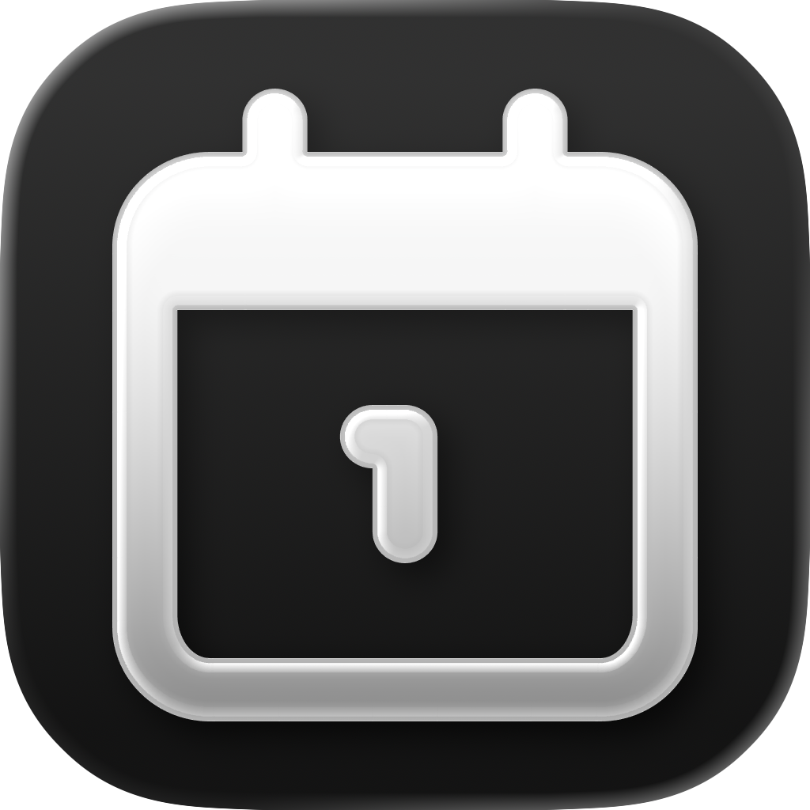

<div align="center">
  
</div>

<h1 align="center">
  TimeTrace
</h1>

<p align="center">
  <!-- SwiftUI -->
  <a href="https://developer.apple.com/xcode/swiftui/" target="_blank"></a>
  <!-- UIKit -->
  <a href="https://developer.apple.com/documentation/uikit" target="_blank"></a>
  <!-- iOS -->
  <a href="https://developer.apple.com/ios/" target="_blank"></a>
  <!-- License -->
  <a href="https://opensource.org/licenses/MIT" target="_blank"></a>
  <!-- Telegram -->
  <a href="https://t.me/KIPPU_Trace"></a>
</p>

<p align="center">
  <a href="./README_EN.md">English</a> | 简体中文
</p>

> 你应该不再忍受那个复古的倒数日，可以看看这个小巧无广的 **TimeTrace**  
> 本项目是安卓 [KIPPU_Trace](https://github.com/KIPPUDESU/KIPPU_Trace) 的 **SwiftUI** 版本，保留安卓数据与交互设计的基础在 iOS 上继续演进与优化  
> 基于 **SwiftUI** 设计，融合 Apple Human Interface Guidelines，在这个版本，依旧有切符的个人审美和小巧思 w  

同倒数日一致，本 App 旨在帮助用户记录生命中的重要时刻，无论是未来的期待计时，还是过往经历的累积记录

## 核心特性

- **记录卡片**：卡片采用 iOS 原生设计，并且根据用户输入的主题字数拥有三种不同的排版
- **重点置顶**：支持将关键事件锁定在首页顶部，拥有更漂亮的显示效果
- **详情显示**：可以自定义背景图与遮罩强度，全屏的海报预览体验，会更有沉浸感吧 w
- **编辑预览**：在编辑页创建用户自己的 TimeTrace 时，可以预览到卡片和详情页的呈现效果
- **个性切换**：支持深色/浅色模式，深度适配系统主题
- **多语支持**：原生支持简体中文、英语、日语，后续会有更多其他语言呢
- **数据安全**：用户可以一键把目前设定的内容全都打包成 Zip 文件，再导入 Zip 恢复卡片

## 快速开始

### 环境要求
* Xcode 27 或更高版本
* iOS 27.0+ SDK
* Swift 6

### 编译与运行
1. 克隆仓库：
   ```bash
   git clone https://github.com/KIPPUDESU/TimeTrace_iOS.git
2. 使用 Xcode 打开 `TimeTrace-iOS.xcodeproj`。
3. 选择合适的 iOS Simulator 或真机。
4. 点击 Run 部署到设备或模拟器。

## 许可证
本项目采用 [MIT License](LICENSE) 许可协议 ^ ^

## 维护与支持
Maintained by KIPPU
如果您有任何建议或发现了 Bug，切符依旧会很喜欢你们的 Issue 的！！！！

---
“我们都可以为岁月留下重要的刻痕”
