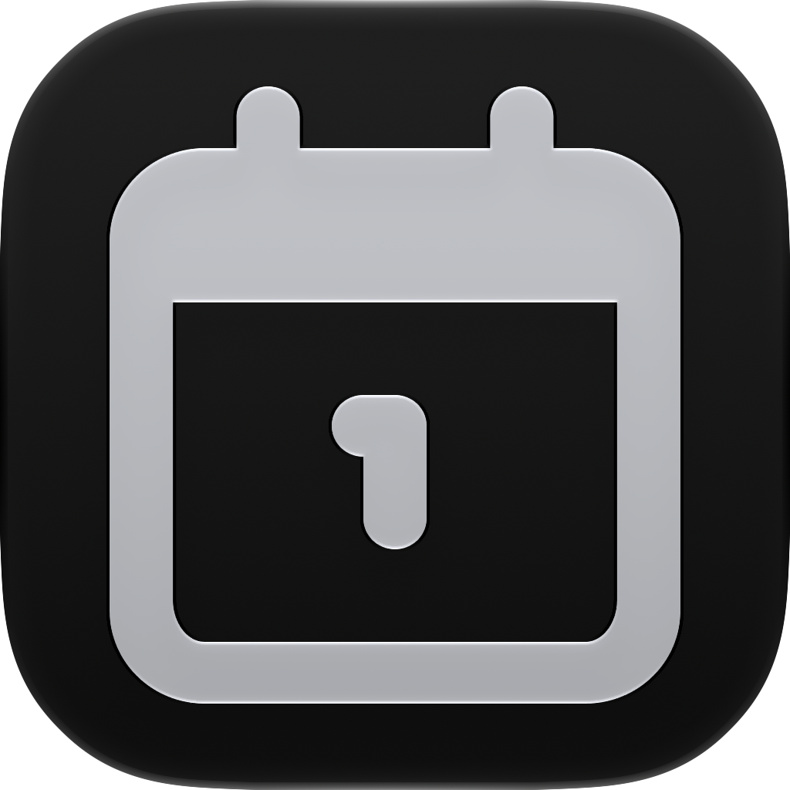

<div align="center">
  
</div>

<h1 align="center">
  TimeTrace
</h1>

<p align="center">
  <!-- SwiftUI -->
  <a href="https://developer.apple.com/xcode/swiftui/" target="_blank"></a>
  <!-- UIKit -->
  <a href="https://developer.apple.com/documentation/uikit" target="_blank"></a>
  <!-- iOS -->
  <a href="https://developer.apple.com/ios/" target="_blank"></a>
  <!-- License -->
  <a href="https://opensource.org/licenses/MIT" target="_blank"></a>
  <!-- Telegram -->
  <a href="https://t.me/KIPPU_Trace"></a>
</p>

<p align="center">
  <a href="./README.md">简体中文</a> | English
</p>

> Stop putting up with that outdated countdown app — meet **TimeTrace**, a tiny and ad-free way to keep count
> This project is the **SwiftUI** edition of the Android [KIPPU_Trace](https://github.com/KIPPUDESU/KIPPU_Trace). Building on the Android data and interaction design, it keeps evolving and polishing on iOS
> Designed with **SwiftUI** and fused with the Apple Human Interface Guidelines, and — as always — with Kippu's personal aesthetic and little touches <3

Like any countdown app, TimeTrace helps you cherish the important moments of life, whether it's counting down to the future or counting up the memories of the past

## Key Features

- **Record cards**: Cards follow a native iOS design, with three different layouts based on how many characters you put in the title
- **Pin to top**: Pin key events to the top of the home screen for a prettier display
- **Detail view**: Customise the background image and mask intensity, with an immersive full-screen poster preview
- **Edit preview**: While creating your own TimeTrace in the editor, preview how the card and detail page will look
- **Theme switching**: Dark / light mode, deeply adapted to the system theme
- **Multi-language**: Native support for Simplified Chinese, English and Japanese, with more languages on the way
- **Data safety**: One-tap to pack everything into a Zip file, and import a Zip to restore your cards

## Quick Start

### Requirements
* Xcode 27 or later
* iOS 27.0+ SDK
* Swift 6

### Build & Run
1. Clone the repository:
   ```bash
   git clone https://github.com/KIPPUDESU/TimeTrace_iOS.git
2. Open `TimeTrace-iOS.xcodeproj` in Xcode.
3. Choose an iOS Simulator or a real device.
4. Press Run to deploy.

## License
This project is licensed under the [MIT License](LICENSE) ^ ^

## Maintained & Supported
Maintained by KIPPU
If you have any suggestions or find a bug, Kippu will still love your Issues!!!!

---
“We can all leave a lasting mark on the years”
